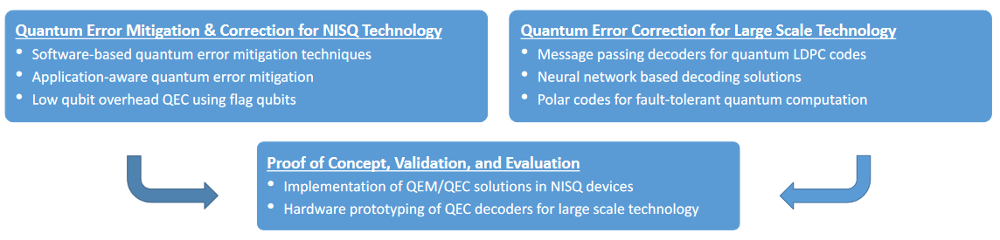

 
# EQUIP: Error Correction for Quantum Information Processing

## Description

The last years have seen significant advances in the field of quantum technologies, consolidating the development of basic requirements for quantum computation. Protecting the quantum computation from noise and decoherence has become more topical than ever, challenging and bringing quantum error correction fairly close to the integration into practical quantum computers. To make such an integration viable, the EQUIP project aims at
1. providing radically new solutions to fault tolerant quantum computation, covering both intermediate and large-scale quantum systems, and
2. bridging the critical gap between algorithmic solutions and latency-power-scalability constrained hardware designs.
To achieve these goals, the project brings together interdisciplinary expertise, extending from the computer science foundations of quantum error correction and fault-tolerant computation, to algorithmic aspects, computer architectures, and hardware designs.

## Main Contributions

The main contributions of the proposed research are as follows.
1. First, the project will develop optimised low-qubit overhead solutions, suited but not restricted to intermediate scale quantum systems, including application-aware and software-based error mitigation techniques, and flag error correction protocols.
2. Second, for large-scale systems, the project will develop thoroughly new approaches to accurate and hardware friendly decoding of quantum low-density parity-check codes, and will explore pioneering approaches relying on quantum polar codes.
3. Third, the effectiveness of the proposed solutions will be demonstrated through either their implementation into real intermediate-scale quantum devices and
quantum simulators, or the hardware prototyping of the most promising decoding solutions for large-scale devices.

The ambition of the proposed research is to cover the essential prerequisites for preparing the European industry for the forthcoming challenge of quantum
technologies.

### Software-based quantum error mitigation techniques
- Investigate the trade-offs of different quantum HW-aware compilation techniques, including mapping and scheduling, and propose more efficient (optimised) error mitigations solutions.
- Develop a SW/compilation framework, including the definition of performance metrics and an overall cost function or figure of merit, and incorporating different error mitigation techniques.

### Application-aware quantum error mitigation
- Identify a class of promising applications for NISQ and study the effects of different errors on the performance. Select algorithms for proof of concept experiments.
- Improve the SW-based error mitigation techniques, by adapting the software according to the quantum algorithm’s properties.

### Low qubit overhead QEC using flag qubits
- Methodology for efficiently implementing low-qubit overhead QEC protocols on resource-constrained quantum processors that includes the use of graph embedding techniques for their mapping as well as circuit optimization.
- Cross-stack approach, where flag qubits are used to extract flag information from the high-level circuit to augment error-correction capabilities.
- Investigate the performance of QEC codes with flag qubits in the presence of biased noise and for HW-inspired error models.

### Iterative message passing decoders for quantum LDPC codes
- Investigate the design of general purpose MP-based decoding algorithms for quantum LDPC codes, suitable for high-speed, low-power, scalable implementations.
- Use insights provided by quantum trapping sets into error prone structures, for optimizing novel decoding rules, able to cope with the code degeneracy.
- Propose simplifications and/or optimizations of iterative decoding algorithms, including message passing and small set flip based approaches.

### Development of neural-network based decoding solutions
- Investigate NN-based decoders and diversity architectures, capable of handling code degeneracy, in a manner that is scalable with respect to decoding and training.
- Investigate HW-convenient NN-based decoders, e.g., that can be mapped back to MP decoding algorithms, suitable for later hardware implementations and meeting the constraints of the quantum system

### Polar codes for fault-tolerant quantum computation
- Develop a complete framework of fault-tolerant quantum computation using quantum polar codes, incorporating fault-tolerant procedures for logic state
preparation, error syndrome extraction, and a universal set of logic gates
- Investigate optimized mappings onto connectivity-constrained architectures, so as to minimize the number and extent of distant operations.

### Implementation of QEM/QEC solutions in NISQ devices
- Adapt the most efficient compilation techniques developed for a target quantum hardware in which experiments will be run e.g., HW platforms made available by IBM, the OpenSuperQ and the Finnish IQM projects).
- Prototypically implement: a) a software feedback loop for the experiments to run close to real-time; b) software circuit simulations with efficient sampling capabilities to be coupled to the correction and mitigation solutions.

### Hardware prototyping of QEC decoders for large scale technology
- Design hardware architectures for the proposed decoding algorithms, which can be flexibly adapted to different quantum LDPC codes.
- Explore different FPGA design frameworks, so as to a) find the most suitable workflow to meet the quantum technology constraints, and b) simplify the changes in the hardware when either the structure or the decoding rules of the QEC need to be updated.
